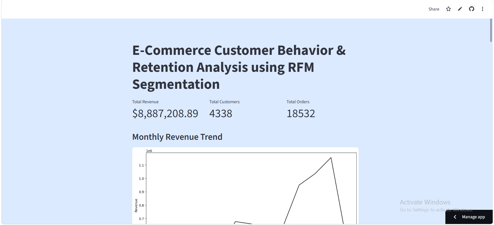
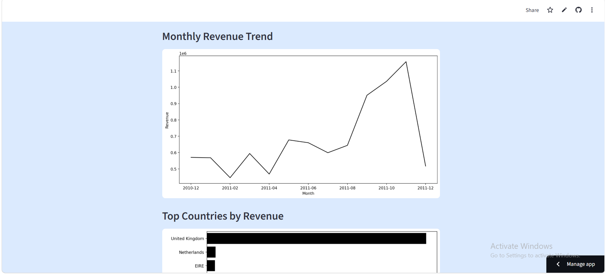
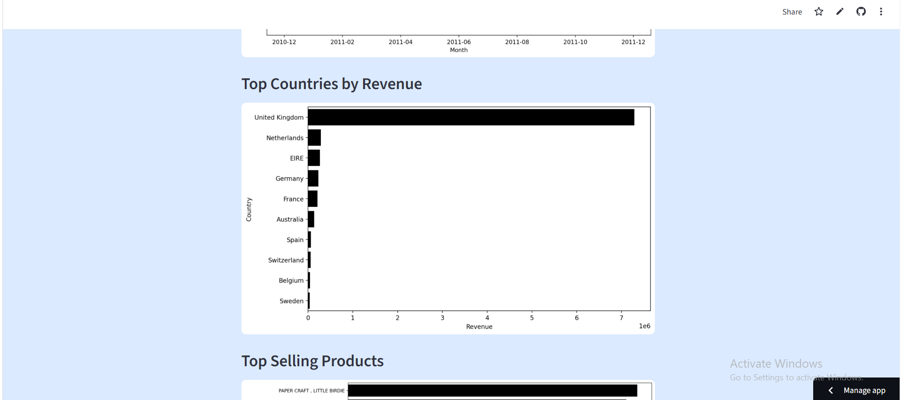
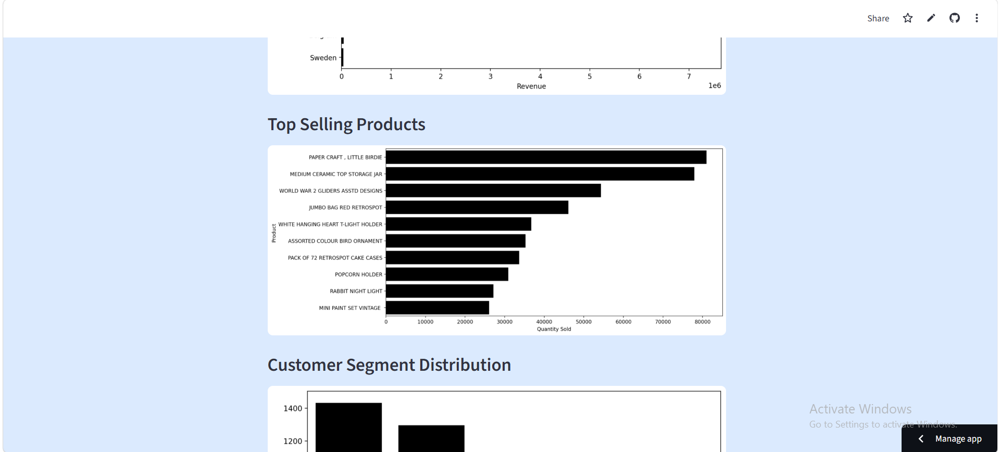
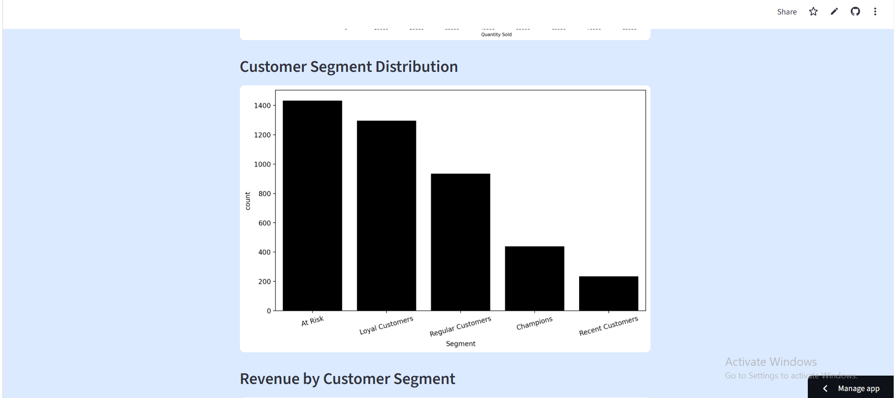
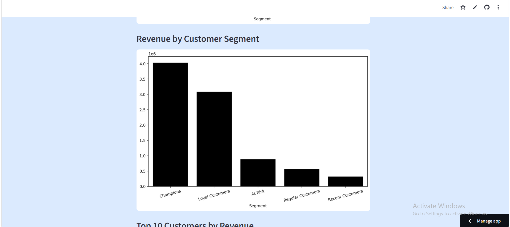
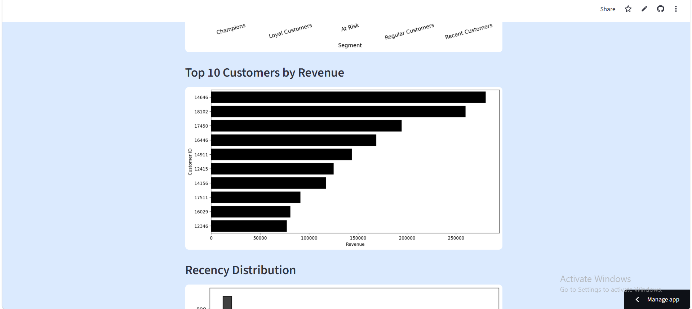
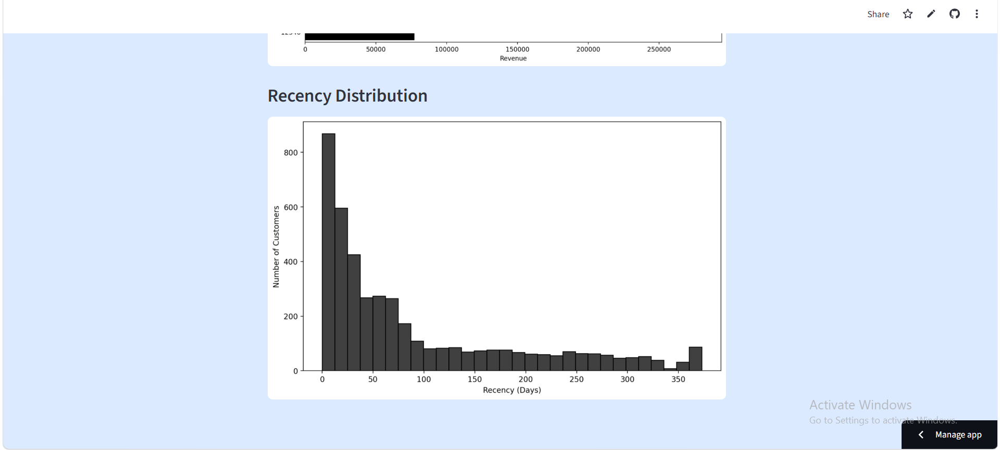

# 🛒 E-Commerce Customer Behavior & Retention Analysis using RFM Segmentation

This project is a **Customer Analytics and Retention Analysis** application that analyzes customer purchasing behavior using **RFM (Recency, Frequency, Monetary) Segmentation**.

The project is built using **Python**, visualized through an interactive **Streamlit Dashboard**, and focuses on identifying valuable customers and understanding customer retention patterns.

---

## 🚀 Live Demo

👉 [Click here to use the app](https://ecommerce-rfm-analysis-3p46pxtgcfcb752auovadq.streamlit.app/)

---

## 📸 Dashboard Preview

Below is the Streamlit dashboard interface of the project:

### KPI Metrics

### Monthly Revenue Trend

### Top Countries by Revenue

### Top Selling Products

### Customer Segment Distribution

### Revenue by Customer Segment

### Top 10 Customers by Revenue

### Recency Distribution

---

## 🧠 Project Overview

This project performs:

* Data Cleaning & Preprocessing
* Exploratory Data Analysis (EDA)
* RFM-Based Customer Segmentation
* Customer Retention Analysis
* Business Insight Generation
* Interactive Streamlit Dashboarding

---

## ⚙️ Technologies Used

* Python
* Pandas
* Matplotlib
* Seaborn
* Streamlit
* Jupyter Notebook
* GitHub

---

## 📊 Dataset

This project uses the Online Retail dataset.

Main dataset features include:

* Invoice Number
* Customer ID
* Invoice Date
* Quantity
* Unit Price
* Country

---

## 🧹 Data Cleaning Steps

The following preprocessing steps were performed:

* Removed missing Customer IDs
* Removed cancelled invoices and invalid transactions
* Removed duplicate records
* Filtered negative quantities and invalid prices
* Converted InvoiceDate to datetime format
* Created TotalPrice feature for revenue analysis

---

## 📈 RFM Segmentation

Customers were segmented using:

### 🕒 Recency
How recently a customer made a purchase

### 🔁 Frequency
How often a customer made purchases

### 💰 Monetary
How much money a customer spent

---

## 👥 Customer Segments

The project categorizes customers into:

* 🏆 Champions
* 💎 Loyal Customers
* 🆕 Recent Customers
* 👤 Regular Customers
* ⚠️ At Risk Customers

---

## 📊 Dashboard Features

The Streamlit dashboard includes:

* KPI Metrics
* Monthly Revenue Trend
* Top Countries by Revenue
* Top Selling Products
* Customer Segment Distribution
* Revenue by Customer Segment
* Top 10 Customers by Revenue
* Recency Distribution

---

## 📂 Project Structure

### Core Files

* **app.py** → Streamlit dashboard application
* **ecommerce_rfm.ipynb** → Complete analysis notebook
* **cleaned_ecommerce_data.csv** → Cleaned dataset

### Supporting Files

* **requirements.txt** → Project dependencies
* **README.md** → Project documentation
* **screenshots/** → Dashboard screenshots

---

## 🔄 How It Works

1. Dataset is loaded and preprocessed
2. Invalid and duplicate records are removed
3. RFM metrics are calculated for each customer
4. Customers are segmented based on RFM scores
5. Business insights are generated through visualizations
6. Streamlit dashboard displays interactive analytics

---

## 📌 Insights

* Loyal customers contribute major revenue
* High-value customers can be targeted for retention
* Some customers are at risk of churn
* Revenue trends reveal purchasing behavior patterns

---

## 🛠️ How to Run Locally

1. Clone the repository:
   git clone https://github.com/sheema-sul/ecommerce-rfm-analysis.git

2. Navigate to project folder:
   cd ecommerce-rfm-analysis

3. Install dependencies:
   pip install -r requirements.txt

4. Run the app:
   streamlit run app.py

---

## ⚠️ Limitations

* RFM analysis is rule-based and does not use machine learning
* Customer behavior is analyzed only from available transaction data
* Results may vary depending on data quality and time period

---

## 🌟 Future Improvements

* Add Customer Lifetime Value (CLV) analysis
* Add predictive retention modeling
* Add interactive dashboard filters

---

## 👩‍💻 Author

**Sheema Sultana**  
Aspiring Data Scientist | Data Visualization & Analytics Enthusiast
